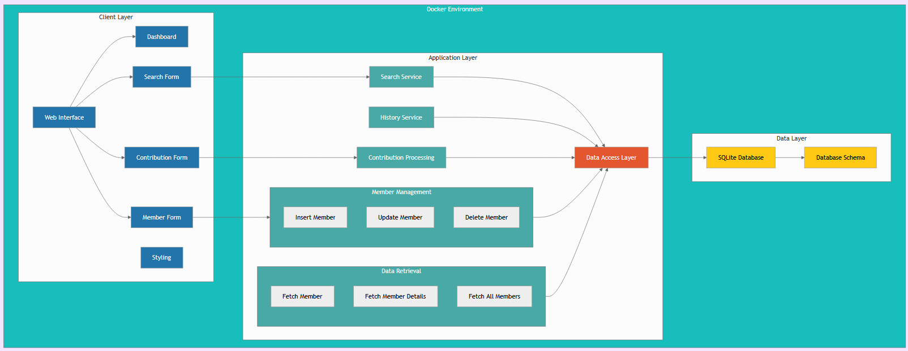

# Gestion des Contributions - Mosquée Errahma

Bienvenue dans le **Gestion des Contributions** de la **Mosquée Errahma** ! 🕌✨ Ce projet ambitieux a pour mission de simplifier la gestion des contributions, dons, cotisations et projets, tout en assurant un suivi efficace des adhérents et donateurs. Grâce à ce système, la Mosquée Errahma peut se concentrer sur l'essentiel : servir la communauté avec transparence et efficacité.


## Table des Matières

- [À propos](#à-propos)
- [Schéma Global](#schema-global-du-projet)
- [Fonctionnalités](#fonctionnalités)
- [Prérequis](#prérequis)
- [Installation](#installation)
- [Structure du Projet](#structure-du-projet)
- [Base de Données](#base-de-données)
- [Exemple d'Utilisation](#exemple-dutilisation)
- [Logique Applicative](#logique-applicative)
- [Workflow de Contribution](#workflow-de-contribution)
- [Auteurs](#auteurs)
- [Remerciements](#remerciements)
- [License](#license)

## À propos

Ce projet vise à mettre en place un système complet de gestion des contributions, dons, cotisations et projets pour la **Mosquée Errahma**. Grâce à ce système, vous pourrez :

- **Suivre les contributions** des adhérents et donateurs.
- **Gérer les cotisations mensuelles** avec un historique détaillé.
- **Visualiser les statistiques** via un tableau de bord interactif.
- **Afficher dynamiquement** les cotisations dans le hall d'entrée pour une transparence accrue.

L'objectif est de faciliter la gestion administrative tout en offrant une vue claire et précise des contributions, favorisant ainsi une meilleure organisation et une communication transparente au sein de la communauté.

## Schéma Global du Projet



> Par [GitDiagram](https://gitdiagram.com)

## Fonctionnalités

### Gestion des Adhérents et Donateurs
- **Ajout, modification et suppression** d'adhérents.
- **Gestion des cotisations mensuelles** avec historique.
- **Recherche avancée** d'adhérents par nom, email ou téléphone.

### Contributions
- **Gestion des cotisations, dons et projets**.
- **Paiements partiels ou complets**.
- **Suivi des contributions** avec détails sur le type et le montant.

### Tableau de Bord Interactif
- **Visualisation des statistiques** : montants collectés, évolution mensuelle, répartition par type de contribution.
- **Suivi des cotisations mensuelles** avec affichage des mois "payés", "partiels" ou "non payés".

### Affichage Dynamique
- **Tableau public** dans le hall d'entrée montrant les cotisations mensuelles des membres.
- **Design clair et lisible** pour une compréhension rapide des informations présentées.

## Prérequis

Avant de commencer, assurez-vous d'avoir installé :

- [Docker](https://www.docker.com/)
- [Docker Compose](https://docs.docker.com/compose/)

## Installation

1. **Clonez le dépôt :**
    ```sh
    git clone https://github.com/votre-utilisateur/votre-repo.git
    cd votre-repo
    ```

2. **Lancez les services avec Docker Compose :**
    ```sh
    docker-compose up -d
    ```

3. **Accédez à l'application** dans votre navigateur à l'adresse [http://localhost:8080](http://localhost:8080).

## Structure du Projet

```
Directory structure:
└── Tutanka01-Mosquee-Site-Don/
    ├── images/
    ├── compose.yaml
    ├── readme.md
    └── src/
        ├── db.php
        ├── index.php
        ├── schema.sql
        ├── update_adherent.php
        ├── fetch_adherents.php
        ├── fetch_factures.php
        ├── fetch_adherent_details.php
        ├── fetch_member.php
        ├── styles/
        │   ├── style-public-display.css
        │   ├── images/
        │   ├── style-index-confirmation.css
        │   └── style-dashboard.css
        ├── fetch_member_details.php
        ├── insert_adherent.php
        ├── libs/
        ├── fetch_adherent_history.php
        ├── delete_adherent.php
        ├── fetch_adherent_search.php
        ├── dashboard.php
        ├── public_display.php
        └── insert.php

```

### Description des Fichiers

- **`compose.yaml`** : Configuration Docker Compose pour le serveur PHP.
- **`src/`** : Contient les fichiers source PHP, SQL et CSS.
  - **`index.php`** : Point d'entrée principal pour enregistrer les contributions.
  - **`dashboard.php`** : Tableau de bord pour l'administration et la visualisation des statistiques.
  - **`public_display.php`** : Affichage public des cotisations dans le hall d'entrée.
  - **`db.php`** : Gestion de la connexion à la base de données SQLite.
  - **`libs/`** : Bibliothèques tierces (DomoPDF...).
  - **Scripts PHP** : 
    - **`insert.php`** : Insertion des contributions.
    - **`update_adherent.php`** : Mise à jour des informations des adhérents.
    - **`fetch_adherents.php`** : Récupération des adhérents.
    - **`fetch_factures.php`** : Récupération des factures.
    - **`fetch_adherent_details.php`** : Détails d'un adhérent spécifique.
    - **`fetch_member.php`** : Récupération des membres actifs.
    - **`fetch_member_details.php`** : Détails d'un membre actif spécifique.
    - **`insert_adherent.php`** : Insertion d'un nouvel adhérent.
    - **`fetch_adherent_history.php`** : Historique des contributions d'un adhérent.
    - **`delete_adherent.php`** : Suppression d'un adhérent.
    - **`fetch_adherent_search.php`** : Recherche avancée des adhérents.
  - **`styles/`** : Fichiers CSS pour le style de l'application.
  - **`schema.sql`** : Schéma de la base de données SQLite.

## Base de Données

Le système utilise **SQLite** avec trois tables principales :

1. **Adherents** :
    - **id** : Identifiant unique.
    - **nom** : Nom de l'adhérent.
    - **prenom** : Prénom de l'adhérent.
    - **email** : Email unique de l'adhérent.
    - **telephone** : Téléphone de l'adhérent.
    - **date_inscription** : Date d'inscription par défaut à la date courante.
    - **anonyme** : Booléen pour les contributions anonymes.
    - **donateur_temporaire** : Booléen pour les donateurs temporaires.
    - **monthly_fee** : Montant mensuel des cotisations.
    - **start_date** : Date de début de l'adhésion.
    - **end_date** : Date de fin de l'adhésion (peut être `NULL` pour une adhésion "à vie").

2. **Contributions** :
    - **id** : Identifiant unique.
    - **id_adherent** : Référence à l'adhérent (peut être `NULL` pour les contributions anonymes).
    - **type_contribution** : Type de contribution (`cotisation`, `don`, `projet`).
    - **montant** : Montant de la contribution.
    - **type_paiement** : Type de paiement (`espèces`, `carte`, `virement`).
    - **mois** : Mois concerné pour les cotisations.
    - **jour_paiement** : Date de paiement par défaut à la date courante.
    - **heure_paiement** : Heure de paiement par défaut à l'heure courante.
    - **anonyme** : Booléen pour les contributions anonymes.
    - **nom_donateur** : Nom du donateur non-adhérent.
    - **prenom_donateur** : Prénom du donateur non-adhérent.
    - **email_donateur** : Email du donateur non-adhérent.
    - **telephone_donateur** : Téléphone du donateur non-adhérent.

3. **Cotisation_Months** :
    - **id** : Identifiant unique.
    - **id_adherent** : Référence à l'adhérent.
    - **year** : Année de la cotisation.
    - **month** : Mois de la cotisation.
    - **paid_amount** : Montant déjà payé pour ce mois.

## Exemple d'Utilisation

### Ajouter un Adhérent

1. **Accédez à la page d'accueil**.
2. **Cliquez sur "Ajouter un adhérent"**.
3. **Remplissez le formulaire** avec les informations nécessaires.
4. **Soumettez le formulaire**.
5. **Vérifiez l'ajout** dans la liste des adhérents.

### Enregistrer une Contribution

1. **Accédez à la page d'accueil**.
2. **Sélectionnez le type de contribution** (cotisation, don, projet).
3. **Remplissez le formulaire** avec les détails de la contribution.
4. **Soumettez le formulaire**.
5. **Confirmez l'enregistrement** via la page de confirmation.
6. **Telechargez le reçu** si nécessaire.

### Visualiser les Statistiques

1. **Accédez au tableau de bord** via le lien fourni après une contribution ou directement depuis le menu.
2. **Consultez les différents onglets** pour voir les statistiques globales, les cotisations, les dons et les projets.
3. **Analysez les graphiques interactifs** pour une meilleure compréhension des données.

## Logique Applicative

### Gestion des Cotisations Mensuelles
- **Montant Mensuel Personnalisé** : Chaque adhérent dispose d'un montant mensuel de cotisation unique.
- **Répartition Automatique** : Lors d'une contribution, le système calcule automatiquement les mois "payés", "partiels" ou "non payés".
- **Cumul des Cotisations** : Les cotisations peuvent couvrir plusieurs mois en fonction du montant versé.

### Paiements Partiels
- **Flexibilité Financière** : Si une cotisation est insuffisante pour couvrir un mois complet, le système applique la somme aux mois partiels.
- **Gestion Simplifiée** : Les adhérents peuvent effectuer des paiements en plusieurs fois sans complications.

### Recherche et Historique
- **Recherche Avancée** : Trouvez rapidement un adhérent par nom, email ou téléphone.
- **Historique Complet** : Consultez l'historique des contributions d'un adhérent avec tous les détails.

### Tableau de Bord
- **Statistiques Globales** : Visualisez les montants collectés, l'évolution mensuelle et la répartition par type de contribution.
- **Cotisations Mensuelles** : Suivez les mois "payés", "partiels" ou "non payés" de chaque adhérent.

### Affichage Public
- **Transparence et Fierté** : Un tableau récapitulatif des cotisations visible dans le hall d'entrée pour une transparence accrue.
- **Design Élégant** : Présentation claire et professionnelle des informations essentielles.

## Workflow de Contribution

### 1. Ajout d'un Adhérent
1. **Ouvrez la fenêtre modale** "Ajouter un nouvel adhérent".
2. **Remplissez le formulaire** (email unique, montant mensuel, etc.).
3. **Soumettez le formulaire via AJAX**.
4. **Les informations sont ajoutées** à la table `Adherents`.
5. **Les cotisations mensuelles** sont automatiquement générées dans `Cotisation_Months` si nécessaire.

### 2. Enregistrement d'une Contribution
1. **Sélectionnez le type de contribution** (cotisation, don, projet).
2. **Saisissez le montant et les détails**.
3. **Soumettez le formulaire**.
4. **Les données sont insérées** dans la table `Contributions`.
5. **Répartition automatique** des cotisations sur les mois applicables si c'est une cotisation.

## Auteurs

- [**El Akhal El Bouzidi Mohamad**](https://github.com/tutanka01)

## License

Ce projet est sous licence [MIT](LICENSE). La transparence et la liberté sont au cœur de nos valeurs !

---

*P.S. : Si vous rencontrez des problèmes, avez des suggestions ou souhaitez contribuer, n'hésitez pas à ouvrir une issue ou à soumettre une pull request. Ensemble, nous pouvons améliorer ce système pour le bien de toute la communauté.*